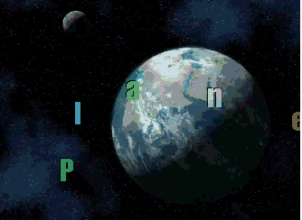



## Messenger Cursor

### Description

This Project is a Mouse Trail Effect on the Desktop based on the Code ID 35924.

Use the Icon on the Systray to change the Text, the Font and the Elasticity.

Requires Windows XP.
 
### More Info
 

             |
---                |---
**Submitted On**   |2007-09-04 12:23:38
**By**             |[Agustin Rodriguez](https://github.com/Planet-Source-Code/PSCIndex/blob/master/ByAuthor/agustin-rodriguez.md)
**Level**          |Intermediate
**User Rating**    |5.0 (70 globes from 14 users)
**Compatibility**  |VB 6\.0
**Category**       |[Graphics](https://github.com/Planet-Source-Code/PSCIndex/blob/master/ByCategory/graphics__1-46.md)
**World**          |[Visual Basic](https://github.com/Planet-Source-Code/PSCIndex/blob/master/ByWorld/visual-basic.md)
**Archive File**   |[Messenger\_208207952007\.zip](https://github.com/Planet-Source-Code/agustin-rodriguez-messenger-cursor__1-69273/archive/master.zip)

